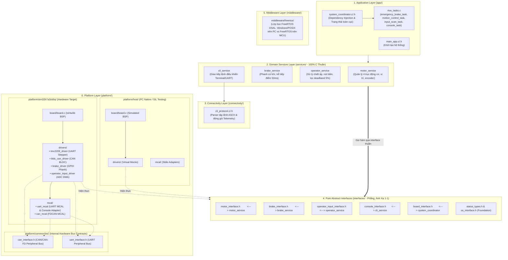

# Surgical Instrument Controller - Hệ Thống Điều Khiển Dụng Cụ Phẫu Thuật Robot 4 Trục (4-Axis Surgical Instrument Controller)

Dự án firmware điều khiển cụm động cơ dụng cụ phẫu thuật nội soi (Surgical Instrument - tương tự chuẩn EndoWrist của robot da Vinci) hiệu năng cao, xây dựng trên vi điều khiển **STM32H7A3ZIT6Q (Bo mạch NUCLEO-H7A3ZI-Q, ARM Cortex-M7 @ 280MHz, SMPS)** kết hợp hệ điều hành thời gian thực **FreeRTOS**. Mã nguồn được thiết kế theo chuẩn **Clean Architecture / Layered Architecture**, bảo đảm tách biệt 100% giữa logic nghiệp vụ và phần cứng vi điều khiển, cho phép kiểm thử Software-in-the-Loop (SIL) toàn diện trên máy tính (Host PC) mà không cần bo mạch thật.

---

## 📌 1. Kiến Trúc Phân Tầng (Clean Architecture)

Hệ thống được phân định ranh giới nghiêm ngặt thành 6 phân tầng độc lập:



---

## 📁 2. Cấu Trúc Thư Mục Dự Án (Project Tree)

```text
surgical-instrument-controller/
├── app/                            # Tầng Application Coordinator & FreeRTOS Tasks
│   ├── inc/                        # app_config.h, main_app.h, rtos_tasks_config.h, system_coordinator.h
│   ├── src/                        # main_app.c, rtos_tasks.c, system_coordinator.c (Full Doxygen)
│   └── CMakeLists.txt              # Cấu hình xuất nhị phân (.elf, .hex, .bin)
├── connectivity/                   # Tầng giao thức ngoài (Connectivity)
│   ├── inc/cli_protocol.h          # Định nghĩa gói tin text ASCII & telemetry
│   ├── src/cli_protocol.c          # Parser logic thuần túy (SET_THROTTLE, EMERGENCY_STOP,...)
│   └── CMakeLists.txt
├── interfaces/                     # Tầng hợp đồng C thuần (Pure Abstract Interfaces - Cấu trúc phẳng)
│   ├── board_interface.h           # Gom tụ driver phần cứng cho BSP IoHwAb
│   ├── brake_interface.h           # Hợp đồng điều khiển phanh cơ khí
│   ├── console_interface.h         # Hợp đồng Stream I/O (write, read) cho CLI
│   ├── motor_interface.h           # Hợp đồng điều khiển động cơ bước & BLDC
│   ├── operator_input_interface.h  # Hợp đồng đọc chiết áp, joystick và nút bấm
│   ├── os_interface.h              # Hợp đồng trừu tượng hóa hệ điều hành
│   ├── status_types.h              # Kiểu dữ liệu mã lỗi chuẩn (status_t)
│   └── CMakeLists.txt
├── middleware/                     # Tầng phần mềm trung gian
│   └── freertos/                   # FreeRTOS OSAL abstraction (chạy cả trên PC và MCU)
├── platform/                       # Tầng hiện thực phần cứng & BSP (Tách biệt hoàn toàn)
│   ├── common/inc/                 # Hợp đồng bus nội bộ platform: can_interface.h, uart_interface.h
│   ├── host/                       # Hiện thực giả lập cho PC SIL testing
│   └── stm32h7a3zit6q/             # Nền tảng vi điều khiển STM32H7A3ZIT6Q (NUCLEO-H7A3ZI-Q)
│       ├── board/board.c           # IoHwAb khởi tạo & liên kết driver phần cứng
│       ├── drivers/                # tmc2209_driver, bldc_can_driver, brake_driver, operator_input_driver
│       ├── mcal/                   # uart_mcal, can_mcal
│       ├── cubemx/                 # Code sinh từ CubeMX (HAL Drivers, FreeRTOS, Linker Script, Startup)
│       └── platform.cmake          # Script nạp nguồn và cờ liên kết cho STM32H7A3ZIT6Q
├── services/                       # Tầng Domain Services (Thuần C - 0% phụ thuộc vi điều khiển)
│   ├── brake_service/              # Nghiệp vụ phanh an toàn & trễ tiếp điểm cơ khí
│   ├── cli_service/                # Dịch vụ thông dịch dòng lệnh Terminal
│   ├── motor_service/              # Nghiệp vụ điều khiển 4 trục động cơ, vị trí, vận tốc
│   └── operator_service/           # Nghiệp vụ người vận hành, lọc deadband 5%
├── tests/                          # Tầng Unit Tests & Kiểm thử SIL Unity (65 Test Cases)
│   ├── app/                        # Test case kiểm tra System Coordinator
│   ├── middleware/                 # Test case kiểm tra FreeRTOS OSAL
│   ├── drivers/                    # Test cases cho hardware drivers
│   ├── connectivity/               # Test case cho CLI protocol
│   ├── services/                   # Test cases cho Motor, Brake, Operator Services
│   └── CMakeLists.txt              # Cấu hình Unity runner & gcovr HTML report
├── .agent/                         # Bộ nhớ AI Agent, Rules và Skills chuyên dụng
│   ├── rules/                      # coding_standards.md, commit_standards.md
│   └── skills/                     # codebase-index, embedded-toolchain-architect, embedded-tester,...
├── .vscode/                        # Cấu hình IDE VS Code chuyên nghiệp (100% đường dẫn tương đối)
│   ├── launch.json                 # Cấu hình nạp & debug Cortex-Debug ST-Link
│   ├── settings.json               # Thiết lập môi trường PATH và toolchain
│   └── tasks.json                  # Tự động hóa build & test qua phím tắt
├── arm-none-eabi-gcc.cmake         # Toolchain CMake biên dịch chéo ARM GNU
├── CMakeLists.txt                  # CMake điều khiển gốc toàn hệ thống
├── CMakePresets.json               # Cấu hình Presets chuẩn CMake 3.20+ (Thống nhất thư mục build/)
└── README.md                       # Tài liệu hướng dẫn này
```

---

## 🛠 3. Môi Trường & Công Cụ Yêu Cầu (Prerequisites)

Dự án sử dụng các công cụ tiêu chuẩn, cấu hình hoàn toàn qua biến môi trường tương đối (`${env:LOCALAPPDATA}` và `${env:SystemDrive}`):

1. **Bộ biên dịch chéo ARM MCU**:
   - `arm-none-eabi-gcc` v14.3.1 (đi kèm gói STM32Cube bundle).
   - Đường dẫn: `$env:LOCALAPPDATA\stm32cube\bundles\gnu-tools-for-stm32\14.3.1+st.2\bin`.
2. **Bộ biên dịch Host PC (SIL GoogleTest)**:
   - MinGW-W64 GCC/G++ v16.1.0 UCRT (cài đặt qua WinGet `BrechtSanders.WinLibs.POSIX.UCRT`).
   - Đường dẫn: `$env:LOCALAPPDATA\Microsoft\WinGet\Packages\BrechtSanders.WinLibs.POSIX.UCRT_Microsoft.Winget.Source_8wekyb3d8bbwe\mingw64\bin`.
3. **Công cụ Build & Generator**:
   - `CMake` (v3.20+) và `Ninja`.
   - Đường dẫn: `$env:LOCALAPPDATA\stm32cube\bundles\cmake\...` và `ninja\...`.
4. **Công cụ sinh báo cáo Coverage HTML**:
   - `gcovr` v8.6 (Python 3.13).
   - Đường dẫn: `$env:LOCALAPPDATA\Programs\Python\Python313\Scripts\gcovr.exe`.
5. **Nạp & Gỡ Lỗi Phần Cứng (Debug Probes)**:
   - ST-LINK GDB Server & STM32CubeProgrammer CLI (trong thư mục cài đặt STM32CubeIDE).

---

## 🚀 4. Hướng Dẫn Biên Dịch & Chạy Test (Quick Start)

Toàn bộ các tác vụ biên dịch đều xuất ra thư mục duy nhất: **`build/`**.

### Cách 1: Sử dụng phím tắt VS Code (Khuyến nghị)
Nhấn tổ hợp phím **`Ctrl+Shift+B`** trên bàn phím để chọn tác vụ mong muốn:
- **`1. Build Firmware (STM32H7A3ZIT6Q / NUCLEO-H7A3ZI-Q)`**: Tự động cấu hình và biên dịch firmware vi điều khiển STM32H7A3ZIT6Q, xuất file `.elf`, `.hex`, `.bin`.
- **`2. Flash Firmware to Board (STM32H7A3ZIT6Q / ST-LINK)`**: Nạp firmware vào bo mạch qua STM32CubeProgrammer CLI.
- **`3. Rebuild Firmware (Clean & Build)`**: Dọn dẹp và biên dịch lại toàn bộ firmware từ đầu.
- **`4. Run Unit Tests (Unity SIL)`**: Biên dịch và chạy toàn bộ 65 bài kiểm thử Unity SIL trên PC.
- **`5. Run Unit Tests with Coverage (HTML Report)`**: Chạy unit tests kèm đo độ bao phủ mã nguồn và tự động kết xuất báo cáo HTML trực quan.
- **`6. Clean All (Firmware & Tests)`**: Dọn sạch thư mục `build/`.

### Cách 2: Sử dụng dòng lệnh qua CMake Presets

#### 1. Biên dịch Firmware Nạp Bo Mạch STM32H7A3ZIT6Q
```powershell
cmake --fresh --preset stm32h7a3zit6q
cmake --build --preset stm32h7a3zit6q
```
Thành phẩm sinh ra tại thư mục `build/app/`:
- `surgical_instrument_controller_stm32h7a3zit6q.elf` (File nhị phân kèm bảng ký hiệu debug)
- `surgical_instrument_controller_stm32h7a3zit6q.hex` (File nạp định dạng Intel HEX)
- `surgical_instrument_controller_stm32h7a3zit6q.bin` (File nhị phân thuần)

#### 2. Chạy SIL Unit Tests trên PC (Unity)
```powershell
cmake --fresh --preset host-tests
cmake --build --preset host-tests
ctest --preset host-tests
```

#### 3. Chạy Kiểm Thử & Sinh Báo Cáo Coverage HTML (Unity + gcovr)
```powershell
cmake --fresh --preset coverage
cmake --build --preset coverage
ctest --preset coverage
cmake --build --preset coverage --target coverage_report
```

### Cách 3: Biên dịch & Kiểm thử cô lập bằng Docker (Reproducible Builds)

Dự án hỗ trợ môi trường Docker đóng băng toàn bộ toolchain (`Ubuntu 22.04`, `ARM GNU GCC 13.3.rel1`, `GCC 12`, `CMake`, `Ninja`, `gcovr`):

#### 1. Build Docker Image (Một lần đầu)
```bash
docker compose build
```

#### 2. Biên dịch Firmware STM32H7A3ZIT6Q trong Container
```bash
docker compose run --rm surgical-instrument-builder sh -c "cmake --preset linux-stm32h7a3zit6q && cmake --build --preset linux-stm32h7a3zit6q"
```

#### 3. Chạy Unit Tests & Xuất Coverage HTML trong Container
```bash
docker compose run --rm surgical-instrument-builder sh -c "cmake --preset linux-coverage && cmake --build --preset linux-coverage && ctest --preset linux-coverage && cmake --build --preset linux-coverage --target coverage_report"
```

#### 4. Mở Interactive Shell
```bash
docker compose run --rm surgical-instrument-builder bash
```

Hoặc trong VS Code: Nhấn `F1` -> Chọn **"Dev Containers: Reopen in Container"** để lập trình trực tiếp bên trong Docker.

---

## 📊 5. Kết Quả Kiểm Thử & Đo Lường Độ Bao Phủ Mã (Coverage)

### 5.1. Kết Quả Chạy 65 Bài Test SIL
Tất cả 65 bài kiểm thử độc lập phần cứng đều đạt **100% Passed**:
- **Hardware Drivers (STM32H7A3ZIT6Q)**: 26 tests
  - TMC2209 Stepper Driver: 7 tests (Khởi tạo, bật/tắt động cơ, đổi chiều quay, di chuyển vị trí, homing, null guard).
  - BLDC CAN Driver: 10 tests (Khởi tạo, đóng gói bản tin CAN điều khiển vận tốc/vị trí, giải mã telemetry, lọc ID node).
  - Brake Driver: 5 tests (Khởi tạo, nhả phanh an toàn, khóa phanh, null guard).
  - Operator Input Driver: 4 tests (Khởi tạo, tính chuẩn hóa đa trục ADC DMA, nút nhấn phanh, null guard).
- **Domain Services**: 19 tests
  - Motor Service: 8 tests (Khởi tạo, quản lý 4 trục, liên kết driver, nội suy vị trí/vận tốc, homing, dừng khẩn cấp).
  - Brake Service: 8 tests (Khởi tạo, định thời trễ cơ khí 50ms, khóa/nhả an toàn, cảnh báo trạng thái).
  - Operator Service: 3 tests (Khởi tạo, lọc vùng chết 5%, phát hiện tín hiệu nút bấm phanh).
- **Connectivity**: 7 tests (Phân tích gói lệnh ASCII, điều khiển throttle, đóng gói bản tin telemetry trạng thái).
- **Middleware OSAL**: 5 tests (Tạo/hủy tác vụ FreeRTOS, mutex, hàng đợi queue, software timer, hàm thời gian).
- **Application**: 8 tests (Khởi tạo Coordinator, Dependency Injection, truyền thông điệp phanh khẩn cấp, xử lý ngoại lệ).

### 5.2. Báo Cáo HTML Trực Quan (`gcovr`)
Sau khi chạy task coverage, Kỹ sư V có thể mở trực tiếp file báo cáo tại:
👉 **[`build/coverage_report/index.html`](build/coverage_report/index.html)**

Tính năng báo cáo HTML:
- Dashboard tổng quan: Đo lường chính xác **Line Coverage**, **Function Coverage**, và **Branch Coverage**.
- Trực quan hóa chi tiết từng file mã nguồn:
  - Dòng code màu **xanh lá**: Đã được bao phủ bởi Unit Tests.
  - Dòng code màu **đỏ**: Chưa được thực thi tới (giúp định hướng viết thêm test cases xử lý ngoại lệ).

---

## 🛡 6. Tiêu Chuẩn Kỹ Thuật & Bộ Nhớ (Embedded Standards)

1. **Chuẩn tài liệu Doxygen**: 100% các hàm và cấu trúc dữ liệu trong tầng `app/` và các tầng kế tiếp đều có chú thích Doxygen đầy đủ (`@brief`, `@param[in/out]`, `@return`, `@note`, `@warning`).
2. **Quản lý bộ nhớ thời gian thực (Zero Dynamic Allocation)**:
   - Không sử dụng `malloc()` / `free()` trong vòng lặp điều khiển chính (Runtime loop).
   - FreeRTOS tasks, queues và mutexes đều được cấp phát tĩnh hoặc quản lý qua vùng nhớ heap định trước (`heap_4.c` với heap size 32KB).
   - Phân vùng bộ nhớ STM32H7A3ZIT6Q: Vector ngắt và biến thời gian thực nằm trong `DTCMRAM` (128KB @ `0x20000000`), vùng đệm lớn và DMA nằm trong `AXI-SRAM` (1024KB @ `0x24000000`).
3. **An toàn phần cứng & Clean Architecture**:
   - Nghiệp vụ (`services/`) tuyệt đối không bao hàm header của HAL vi điều khiển.
   - Các bus phần cứng (`CAN`, `UART`) được đóng gói hoàn toàn trong tầng `platform/common/inc/`, chỉ mở ra hợp đồng trừu tượng cho tầng trên.
